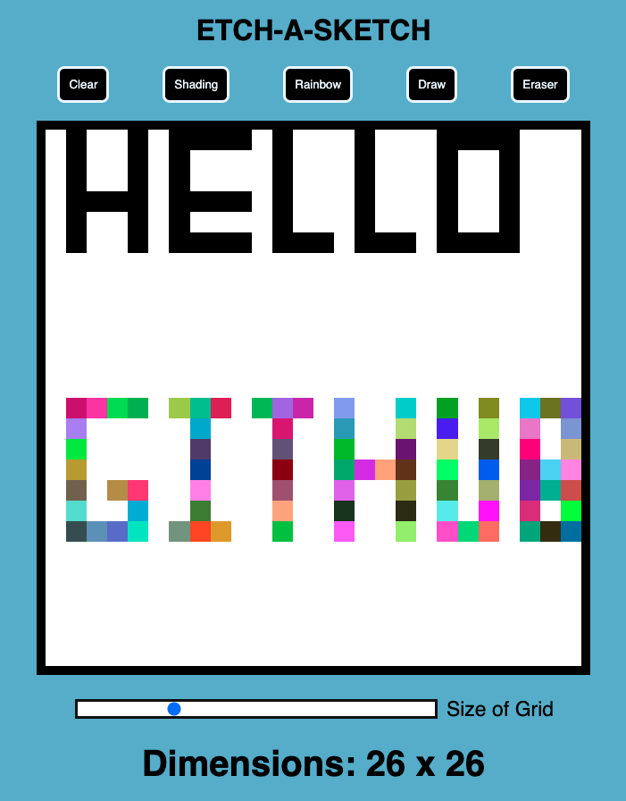

# EtchASketch

This is my version of the Etch-a-Sketch project from The Odin Project. In this project I learned how to add event listeners to my JavaScript code and how to manipulate the DOM directly in JavaScript. 

Here is what each of the buttons do:

    Clear-button: clears the work area and gives a blank Etch-a-Sketch

    Shading: every time you hover over each pixel, the color shade gets a little darker

    Rainbow: Allows you you to draw with constantly changing random colors

    Draw: Draw with black 

    Eraser: Hover over the pixels you have drawn on to remove them

Here is a screenshot of the site:
